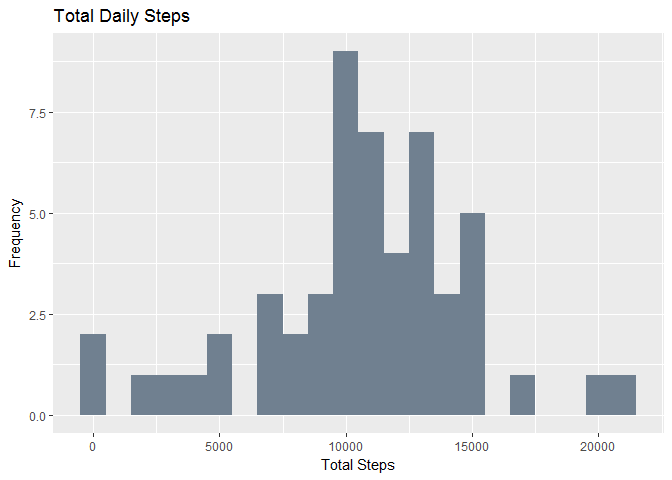
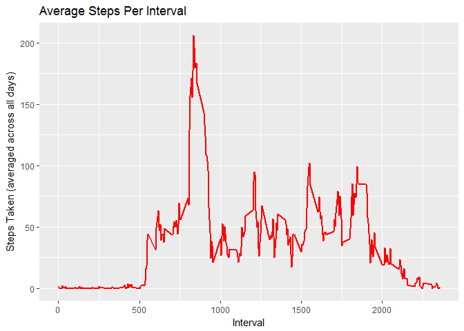
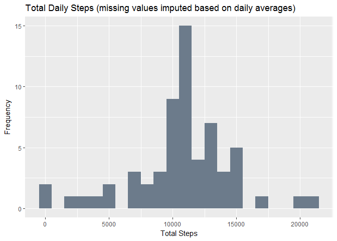
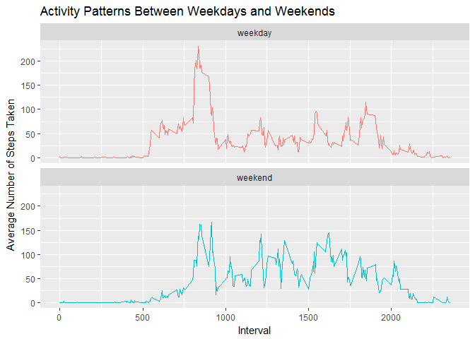

# Reproducible Research Project 1
Kristan Blackhart  
June 17, 2017  

###Introduction
This assignment uses data, collected at 5 minute intervals throughout the day, from a personal activity monitoring device. Collected over a two-month inerval (October-November 2012) from an anonymous individual, the data includes the number of steps taken each day. 

The variables included in the dataset are:

* **steps**: Number of steps taken in a 5-minute interval (missing values are coded as 'NA')

* **date**: Date on which the measurement was taken, in YYYY-MM-DD format

* **interval**: Identifier for the 5-minute interval in which the measurement was taken

The [dataset](https://d396qusza40orc.cloudfront.net/repdata%2Fdata%2Factivity.zip) contains a total of 17,568 observations. 


###Part 1: Loading and Processing the Data

*a) Load the data*

```r
activity <- read.csv("activity.csv")
```

*b) Convert **date** field from character to date type*

```r
activity$date <- as.Date(activity$date)
```


###Part 2: Mean Total Number of Steps Taken Per Day
**NOTE**: Missing values are ignored for calculations in this part.

*a) Calculate the total number of steps taken per day*

```r
totalsteps <- aggregate(activity$steps ~ activity$date, FUN = sum)
colnames(totalsteps) <- c("Date", "Steps")
```

*b) Plot a histogram of the total number of steps taken each day*

```r
library(ggplot2)
```

```
## Warning: package 'ggplot2' was built under R version 3.3.3
```

```r
ggplot(totalsteps, aes(x = Steps)) +
  geom_histogram(fill = "slategray", binwidth = 1000) +
  labs(title = "Total Daily Steps", x = "Total Steps", y = "Frequency")
```

<!-- -->

*c) Calculate and report the mean and median of the total number of steps taken per day*

```r
meansteps <- mean(totalsteps$Steps, na.rm = TRUE)
meansteps
```

```
## [1] 10766.19
```

```r
mediansteps <- median(totalsteps$Steps, na.rm = TRUE)
mediansteps
```

```
## [1] 10765
```


###Part 3: Average Daily Activity Pattern
*a) Plot time series of the 5-minute interval and the average number of steps taken, averaged across all days*

```r
library(dplyr)
```

```
## Warning: package 'dplyr' was built under R version 3.3.3
```

```
## 
## Attaching package: 'dplyr'
```

```
## The following objects are masked from 'package:stats':
## 
##     filter, lag
```

```
## The following objects are masked from 'package:base':
## 
##     intersect, setdiff, setequal, union
```

```r
##Calculate the average number of steps per interval:
interval <- activity%>%
  group_by(interval)%>%
  filter(!is.na(steps))%>%
  summarise(avgsteps = mean(steps, na.rm = TRUE))
##Plot time series:
ggplot(interval, aes(x = interval, y = avgsteps)) +
  geom_line(color = "red", size = 1) +
  labs(title = "Average Steps Per Interval", x = "Interval", y = "Steps Taken (averaged across all days)")
```

<!-- -->

*b) Which 5-minute interval, on average across all days, contains the maximum number of steps?*

```r
interval[which.max(interval$avgsteps),]
```

```
## # A tibble: 1 × 2
##   interval avgsteps
##      <int>    <dbl>
## 1      835 206.1698
```


###Part 4: Imputing Missing Values
Intervals with missing values (coded as 'NA') may introduce bias into some calculations or summaries. Let's try a simple approach for imputing the missing values, and see what difference it makes. 

*a) Calculate and report the total number of missing values in the dataset*

```r
sum(is.na(activity$steps))
```

```
## [1] 2304
```

*b) Use daily mean to fill in missing interval values*

```r
activity2 <- activity
isna <- is.na(activity$steps)
avgint <- tapply(activity2$steps, activity2$interval, mean, na.rm = TRUE, simplify = TRUE)
```

*c) Create a new dataset that duplicates the original, but replaces NAs with imputed values*

```r
activity2$steps[isna] <- avgint[as.character(activity2$interval[isna])]
```

*d) Make a histogram of the total number of steps taken each day*

```r
##Summarize steps by day
totalsteps2 <- activity2%>%
  group_by(date)%>%
  summarise(StepTot = sum(steps, na.rm = TRUE))
##Plot histogram
ggplot(totalsteps2, aes(x = StepTot)) +
  geom_histogram(fill = "slategray4", binwidth = 1000) +
  labs(title = "Total Daily Steps (missing values imputed based on daily averages)", x = "Total Steps", y = "Frequency")
```

<!-- -->

*e) Calculate and report the mean and median total number of steps taken per day - do these values differ from the estimates calculated in Part 2? What is the impact of imputing missing data on the estimates of the total daily number of steps?*

```r
meansteps2 <- mean(totalsteps2$StepTot, na.rm = TRUE)
meansteps2
```

```
## [1] 10766.19
```

```r
mediansteps2 <- median(totalsteps2$StepTot, na.rm = TRUE)
mediansteps2
```

```
## [1] 10766.19
```

The mean number of steps taken per day does not change when the imputed values are added in replacement of the missing values. The median value increases slightly, and is now the same as the mean value. 

###Part 5: Differentiating Activity Patterns Between Weekdays and Weekends
**NOTE**: This part of the assignment continues to use the dataset with the imputed missing values. 

*a) Create a new factor variable in the dataset with two levels - "weekday" and "weekend"*

```r
activity2 <- activity2%>%
  mutate(day = ifelse(weekdays(activity2$date)=="Saturday" | weekdays(activity2$date)=="Sunday", "weekend", "weekday"))
```

*b) Make a panel plot of time series of 5-minute intervals and average number of steps taken, averaged across all weekday/weekend days*

```r
##Calculate the average steps per interval and day type
interval2 <- activity2%>%
  group_by(interval, day)%>%
  summarise(avgsteps2 = mean(steps, na.rm = TRUE))
##Make plots
ggplot(interval2, aes(x = interval, y = avgsteps2, color = day)) +
  geom_line() +
  labs(title = "Activity Patterns Between Weekdays and Weekends", x = "Interval", y = "Average Number of Steps Taken") +
  facet_wrap(~day, ncol = 1, nrow = 2) + 
  theme(legend.position = "none")
```

<!-- -->
